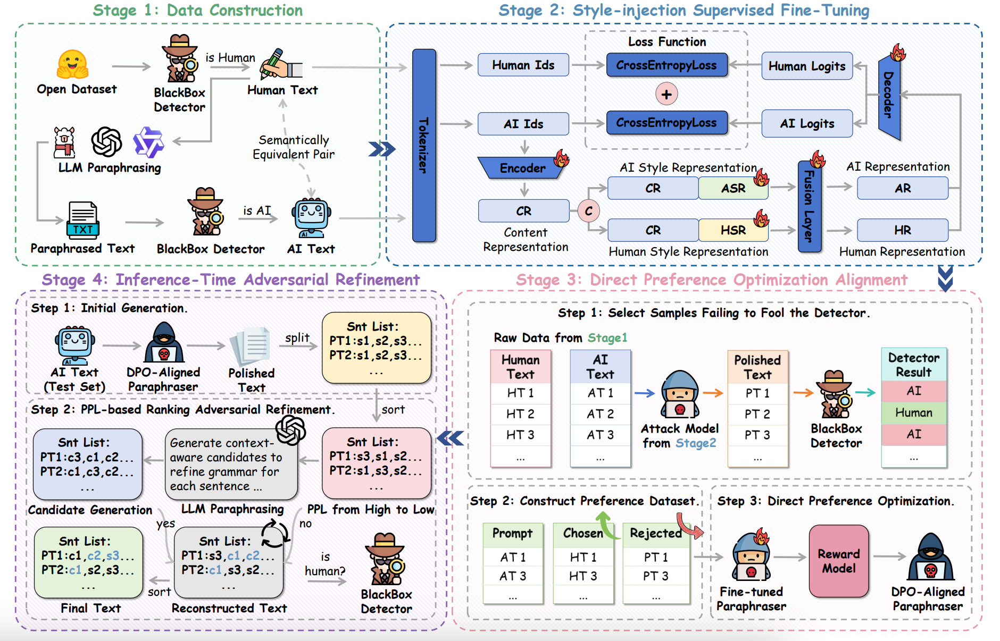

# MASH

Official implementation of **"MASH: Evading Black-Box AI-Generated Text Detectors via Style Humanization"**, accepted at *Findings of ACL 2026*.

[[Paper]](https://arxiv.org/abs/2601.08564)

## Overview

MASH is a multi-stage black-box attack framework that reformulates detector evasion as a **style transfer** task. It trains a lightweight BART-based paraphraser (∼0.1B parameters) through a sequential pipeline—Style-injection SFT, DPO alignment, and inference-time refinement—to transform AI-generated text into human-like text that evades both open-source and commercial detectors.

<p align="center"></p>

### Key Results

- **92% average ASR** across 6 datasets and 5 detectors, surpassing the strongest baselines by 24%.
- Lightweight inference: **∼3 GB GPU memory**, **1.7 s/sample**.
- Zero query cost at inference time (Stages 1–3 are offline).

## Pipeline

| Stage | Script | Description |
|-------|--------|-------------|
| 1 | `stage1_data_construction.py` | Filter human-written text from open-source datasets using a detector |
| 2 | `stage2_style_sft.py` | Train BART with style-injection SFT (dual-objective: reconstruction + transfer) |
| 2→3 | `stage2_inference.py` | Run SFT model inference & collect hard negatives for DPO |
| 3 | `stage3_dpo_alignment.py` | DPO fine-tuning to cross the detector's decision boundary |
| 4 | `stage4_refinement.py` | LLM-guided adversarial refinement with PPL ranking |

## Requirements

```bash
pip install torch transformers datasets trl accelerate tqdm matplotlib numpy
```

## Usage

### Stage 1 — Data Construction

Stream a HuggingFace dataset and retain only samples classified as human-written by the target detector:

```bash
python stage1_data_construction.py \
    --dataset dmitva/human_ai_generated_text \
    --data-file model_training_dataset.csv \
    --num-rows 50000 \
    --model-path /path/to/roberta-detector \
    --output filtered_human_text.jsonl
```

### Stage 2 — Style-Injection SFT

Train the BART paraphraser with dual-objective loss on parallel AI–human pairs:

```bash
python stage2_style_sft.py \
    --bart-path facebook/bart-base \
    --data-path train_pairs.jsonl \
    --output-dir checkpoints/style_sft \
    --epochs 50 \
    --batch-size 8 \
    --lr 2e-5
```

The training data (`train_pairs.jsonl`) should be in JSONL format with `src` (AI text) and `trg` (human text) fields.

### Stage 2 → 3 — Inference & Hard-Negative Collection

Generate style-transferred outputs and identify samples that fail to evade the detector:

```bash
python stage2_inference.py \
    --model-path checkpoints/style_sft/bart \
    --detector-path /path/to/roberta-detector \
    --input-file test_data.jsonl \
    --output-file inference_results.jsonl \
    --batch-size 8
```

### Stage 3 — DPO Alignment

Build preference pairs from hard negatives and run DPO fine-tuning:

```bash
python stage3_dpo_alignment.py \
    --model_name_or_path checkpoints/style_sft/bart \
    --file_a_path inference_results.jsonl \
    --file_b_path train_pairs.jsonl \
    --dpo_output_path dpo_data.jsonl \
    --output_dir checkpoints/dpo
```

### Stage 4 — Inference-Time Refinement (Optional)

Polish DPO outputs sentence-by-sentence using an LLM, accepting changes only when the detector still predicts "human":

```bash
python stage4_refinement.py \
    --input dpo_output.jsonl \
    --output refined_output.jsonl \
    --detector-model /path/to/roberta-detector \
    --llm-path /path/to/llm \
    --ppl-model /path/to/ppl-model
```

## Citation

```bibtex
@article{gu2026mash,
  title={MASH: Evading Black-Box AI-Generated Text Detectors via Style Humanization},
  author={Gu, Yongtong and Li, Songze and Hu, Xia},
  journal={arXiv preprint arXiv:2601.08564},
  year={2026}
}
```

## License

This project is released for **research purposes only**. Please use responsibly and in accordance with applicable laws and regulations.
